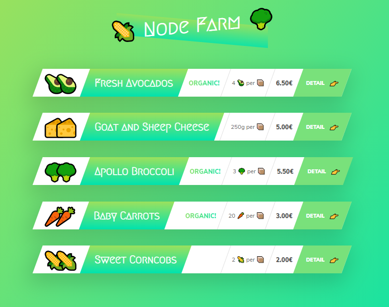
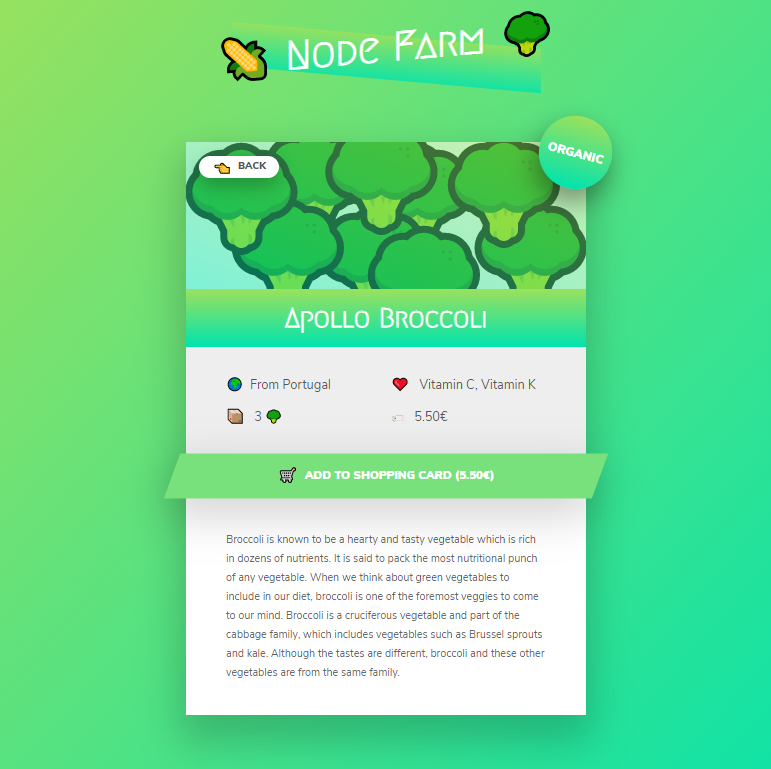

# Nodefarm - Simple node server with html template files

- barebone node server that serves HTML templates with dynamic data from a JSON file.
- no express, just pure http module
- based on Jonas Schmedtmanns Node.js Bootcamp course

## To start

1. Clone github repo and cd into folder
2. Run **npm install** in terminal
3. Run **node index.js**
4. Visit http://localhost:8000

## Screenshots

### Overview

### Product page

